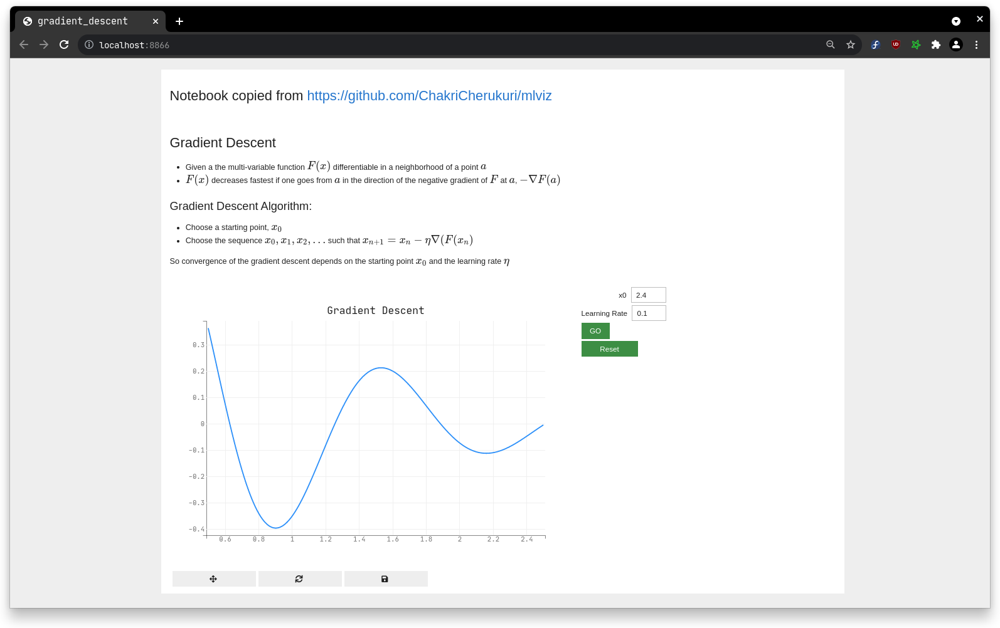
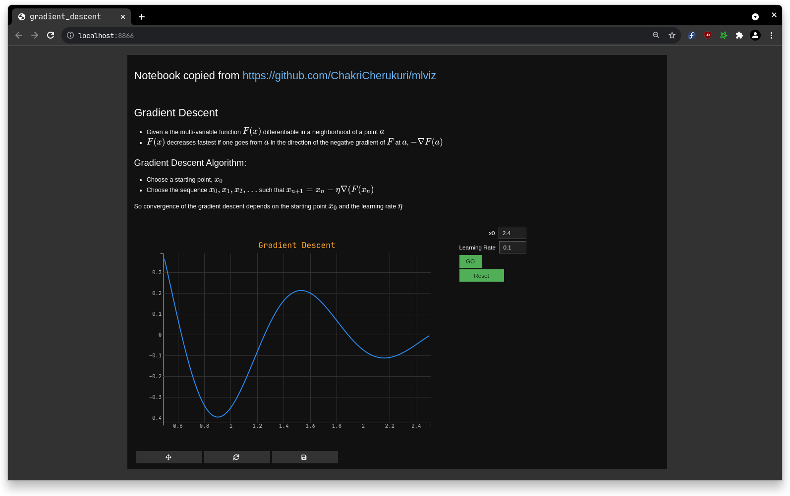

# voila-retro

[](https://mybinder.org/v2/gh/voila-dashboards/voila-retro/stable?urlpath=voila)

Retro design template for voila

## Installation

Soonish

## Usage

```
voila my_notebook.ipynb --template=retro
```

Or for the dark theme:

```
voila my_notebook.ipynb --template=retro --theme=dark
```

### Light theme



### Dark theme


